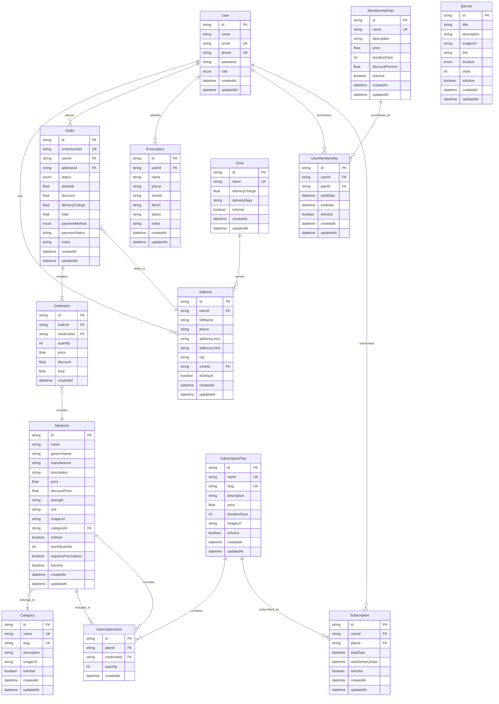

# HealthPlus Pharmacy Subscription System - Database Schema & ERD

**Version:** 1.0  
**Last Updated:** November 22, 2025  
**Related Documentation:**
- [System Requirements Document](./HEALTHPLUS_SRD.md)
- [Architecture & Folder Structure](./ARCHITECTURE.md)
- [API Data Flow](./API_DATA_FLOW.md)

---

## Table of Contents

1. [Overview](#overview)
2. [Database Technology](#database-technology)
3. [Schema Models](#schema-models)
4. [Entity Relationship Diagram](#entity-relationship-diagram)
5. [Relationships Explained](#relationships-explained)
6. [Enums](#enums)
7. [Indexes & Performance](#indexes--performance)
8. [Migration Policy](#migration-policy)
9. [Extension Guidelines](#extension-guidelines)
10. [Data Integrity Rules](#data-integrity-rules)

---

## Overview

The HealthPlus database schema is designed to support:
- User authentication and authorization
- Medicine catalog and inventory management
- Order processing and fulfillment
- Membership program with discounts
- Subscription-based recurring deliveries
- Prescription upload and review workflow
- Admin management and reporting

**Schema Location:** `prisma/schema.prisma`  
**Migrations Location:** `prisma/migrations/`

---

## Database Technology

**Database:** PostgreSQL 15+ (Supabase)  
**ORM:** Prisma 7  
**Connection:** Transaction pooler (port 6543) for serverless compatibility

**Key Features Used:**
- Foreign key constraints for referential integrity
- Cascade deletes for dependent records
- Unique constraints for business rules
- Default values for common fields
- Timestamps for audit trail

---

## Schema Models

### Core Models (Stable - Do Not Change Lightly)

These models are fundamental to the system and changes require careful planning:

#### User

**Purpose:** Store user accounts for customers and admins

**Fields:**
- `id` (String, PK): Unique identifier (CUID)
- `name` (String): User's full name
- `email` (String, Unique, Optional): Email address for login
- `phone` (String, Unique): Phone number for login (required)
- `password` (String): Hashed password (bcrypt)
- `role` (Role Enum): USER or ADMIN
- `createdAt` (DateTime): Account creation timestamp
- `updatedAt` (DateTime): Last update timestamp

**Relations:**
- Has many: `addresses`, `prescriptions`, `orders`, `memberships`, `subscriptions`

**Business Rules:**
- Phone is required and must be unique
- Email is optional but must be unique if provided
- Password must be hashed with bcrypt (never store plain text)
- Default role is USER
- Cannot be deleted if has orders (referential integrity)

---

#### Order

**Purpose:** Store customer orders with payment and delivery information

**Fields:**
- `id` (String, PK): Unique identifier (CUID)
- `orderNumber` (String, Unique): Human-readable order number
- `userId` (String, FK): Reference to User
- `addressId` (String, FK): Reference to Address
- `status` (OrderStatus Enum): Order status (PENDING, CONFIRMED, etc.)
- `subtotal` (Float): Sum of item prices before discount
- `discount` (Float): Membership discount amount
- `deliveryCharge` (Float): Delivery charge from zone
- `total` (Float): Final amount (subtotal - discount + deliveryCharge)
- `paymentMethod` (PaymentMethod Enum): COD or ONLINE
- `paymentStatus` (String): PENDING, PAID, FAILED
- `notes` (String, Optional): Admin or customer notes
- `createdAt` (DateTime): Order creation timestamp
- `updatedAt` (DateTime): Last update timestamp

**Relations:**
- Belongs to: `user`, `address`
- Has many: `items` (OrderItem)

**Business Rules:**
- Order number must be unique and auto-generated
- Cannot be deleted (audit trail), only cancelled
- Status transitions: PENDING → CONFIRMED → PROCESSING → SHIPPED → DELIVERED
- Discount only applies if user has active membership
- Payment status updated to PAID when status is DELIVERED (for COD)

---

#### OrderItem

**Purpose:** Store individual items in an order

**Fields:**
- `id` (String, PK): Unique identifier (CUID)
- `orderId` (String, FK): Reference to Order
- `medicineId` (String, FK): Reference to Medicine
- `quantity` (Int): Quantity ordered
- `price` (Float): Medicine price at time of order
- `discount` (Float): Discount applied to this item
- `total` (Float): Final amount (price × quantity - discount)
- `createdAt` (DateTime): Creation timestamp

**Relations:**
- Belongs to: `order`, `medicine`

**Business Rules:**
- Cascade delete when order is deleted
- Price captured at order time (historical pricing)
- Quantity must be positive
- Total = (price × quantity) - discount

---

#### Medicine

**Purpose:** Store medicine catalog with pricing and inventory

**Fields:**
- `id` (String, PK): Unique identifier (CUID)
- `name` (String): Medicine brand name
- `genericName` (String, Optional): Generic/scientific name
- `manufacturer` (String, Optional): Manufacturer name
- `description` (String, Optional): Medicine description
- `price` (Float): Regular price
- `discountPrice` (Float, Optional): Promotional discount price
- `strength` (String, Optional): Dosage strength (e.g., "500mg")
- `unit` (String): Unit of measurement (default: "pcs")
- `imageUrl` (String, Optional): Medicine image URL
- `categoryId` (String, FK): Reference to Category
- `inStock` (Boolean): Stock availability flag
- `stockQuantity` (Int): Current stock quantity
- `requiresPrescription` (Boolean): Requires prescription flag
- `isActive` (Boolean): Active/inactive flag
- `createdAt` (DateTime): Creation timestamp
- `updatedAt` (DateTime): Last update timestamp

**Relations:**
- Belongs to: `category`
- Has many: `orderItems`, `subscriptionItems`

**Business Rules:**
- Name and category are required
- Price must be positive
- Stock quantity cannot be negative
- If requiresPrescription is true, show warning to customers
- Inactive medicines not shown in catalog

---

#### Category

**Purpose:** Organize medicines into categories

**Fields:**
- `id` (String, PK): Unique identifier (CUID)
- `name` (String, Unique): Category name
- `slug` (String, Unique): URL-friendly slug
- `description` (String, Optional): Category description
- `imageUrl` (String, Optional): Category image URL
- `isActive` (Boolean): Active/inactive flag
- `createdAt` (DateTime): Creation timestamp
- `updatedAt` (DateTime): Last update timestamp

**Relations:**
- Has many: `medicines`

**Business Rules:**
- Name and slug must be unique
- Slug auto-generated from name (lowercase, hyphenated)
- Inactive categories not shown in navigation

---

#### UserMembership

**Purpose:** Track user membership purchases and status

**Fields:**
- `id` (String, PK): Unique identifier (CUID)
- `userId` (String, FK): Reference to User
- `planId` (String, FK): Reference to MembershipPlan
- `startDate` (DateTime): Membership start date
- `endDate` (DateTime): Membership end date
- `isActive` (Boolean): Active flag (computed or manual)
- `createdAt` (DateTime): Purchase timestamp
- `updatedAt` (DateTime): Last update timestamp

**Relations:**
- Belongs to: `user`, `plan` (MembershipPlan)

**Business Rules:**
- User can have multiple memberships (historical)
- Only one active membership at a time (latest with current date between start/end)
- Membership is active if: current_date >= startDate AND current_date <= endDate
- Discount applies automatically during checkout if active

---

#### MembershipPlan

**Purpose:** Define membership plan details (price, duration, discount)

**Fields:**
- `id` (String, PK): Unique identifier (CUID)
- `name` (String, Unique): Plan name (e.g., "Basic Membership")
- `description` (String, Optional): Plan description
- `price` (Float): Membership price (currently 100 BDT)
- `durationDays` (Int): Membership duration (currently 30 days)
- `discountPercent` (Float): Discount percentage (currently 10%)
- `isActive` (Boolean): Active/inactive flag
- `createdAt` (DateTime): Creation timestamp
- `updatedAt` (DateTime): Last update timestamp

**Relations:**
- Has many: `memberships` (UserMembership)

**Business Rules:**
- Name must be unique
- Price, duration, and discount are configurable (not hardcoded)
- Only active plans shown to customers
- Current default: 100 BDT, 30 days, 10% discount

---

#### Subscription

**Purpose:** Track user subscriptions to monthly medicine packs

**Fields:**
- `id` (String, PK): Unique identifier (CUID)
- `userId` (String, FK): Reference to User
- `planId` (String, FK): Reference to SubscriptionPlan
- `startDate` (DateTime): Subscription start date
- `nextDeliveryDate` (DateTime): Next scheduled delivery date
- `isActive` (Boolean): Active/inactive flag
- `createdAt` (DateTime): Creation timestamp
- `updatedAt` (DateTime): Last update timestamp

**Relations:**
- Belongs to: `user`, `plan` (SubscriptionPlan)

**Business Rules:**
- User can have multiple subscriptions (different plans)
- nextDeliveryDate updated after each delivery
- Subscription price is fixed (no membership discount)
- Can be cancelled (isActive = false)

---

#### SubscriptionPlan

**Purpose:** Define subscription pack details and pricing

**Fields:**
- `id` (String, PK): Unique identifier (CUID)
- `name` (String, Unique): Plan name (e.g., "Diabetes Care Pack")
- `slug` (String, Unique): URL-friendly slug
- `description` (String, Optional): Plan description
- `price` (Float): Monthly subscription price
- `durationDays` (Int): Billing cycle duration (default: 30 days)
- `imageUrl` (String, Optional): Plan image URL
- `isActive` (Boolean): Active/inactive flag
- `createdAt` (DateTime): Creation timestamp
- `updatedAt` (DateTime): Last update timestamp

**Relations:**
- Has many: `items` (SubscriptionItem), `subscriptions`

**Business Rules:**
- Name and slug must be unique
- Price is fixed per plan
- Admin creates and manages plans
- Inactive plans not shown to customers

---

#### SubscriptionItem

**Purpose:** Define medicines included in subscription plans

**Fields:**
- `id` (String, PK): Unique identifier (CUID)
- `planId` (String, FK): Reference to SubscriptionPlan
- `medicineId` (String, FK): Reference to Medicine
- `quantity` (Int): Quantity included in pack
- `createdAt` (DateTime): Creation timestamp

**Relations:**
- Belongs to: `plan` (SubscriptionPlan), `medicine`

**Business Rules:**
- Cascade delete when plan is deleted
- Quantity must be positive
- Same medicine cannot be added twice to same plan

---

#### Prescription

**Purpose:** Store uploaded prescriptions for review

**Fields:**
- `id` (String, PK): Unique identifier (CUID)
- `userId` (String, FK): Reference to User
- `name` (String): Patient name
- `phone` (String): Patient phone
- `zoneId` (String, Optional): Delivery zone
- `fileUrl` (String): Uploaded file URL
- `status` (String): PENDING, UNDER_REVIEW, APPROVED, REJECTED
- `notes` (String, Optional): Admin notes
- `createdAt` (DateTime): Upload timestamp
- `updatedAt` (DateTime): Last update timestamp

**Relations:**
- Belongs to: `user`

**Business Rules:**
- Cannot be deleted (audit trail)
- Status transitions: PENDING → UNDER_REVIEW → APPROVED/REJECTED
- Admin can add notes when approving/rejecting
- File size limit: 5MB (enforced in application)

---

### Supporting Models (Flexible - Can Be Extended)

#### Address

**Purpose:** Store user delivery addresses

**Fields:**
- `id` (String, PK): Unique identifier (CUID)
- `userId` (String, FK): Reference to User
- `fullName` (String): Recipient name
- `phone` (String): Recipient phone
- `addressLine1` (String): Address line 1
- `addressLine2` (String, Optional): Address line 2
- `city` (String): City name
- `zoneId` (String, FK): Reference to Zone
- `isDefault` (Boolean): Default address flag
- `createdAt` (DateTime): Creation timestamp
- `updatedAt` (DateTime): Last update timestamp

**Relations:**
- Belongs to: `user`, `zone`
- Has many: `orders`

**Business Rules:**
- Cascade delete when user is deleted
- User can have multiple addresses
- Only one default address per user

---

#### Zone

**Purpose:** Define delivery zones with charges and timing

**Fields:**
- `id` (String, PK): Unique identifier (CUID)
- `name` (String, Unique): Zone name (e.g., "Dhaka Central")
- `deliveryCharge` (Float): Delivery charge for this zone
- `deliveryDays` (String): Estimated delivery days (e.g., "1-2 days")
- `isActive` (Boolean): Active/inactive flag
- `createdAt` (DateTime): Creation timestamp
- `updatedAt` (DateTime): Last update timestamp

**Relations:**
- Has many: `addresses`

**Business Rules:**
- Name must be unique
- Delivery charge must be non-negative
- Inactive zones not available for new addresses

---

#### Banner

**Purpose:** Store promotional banners for homepage and category pages

**Fields:**
- `id` (String, PK): Unique identifier (CUID)
- `title` (String): Banner title
- `description` (String, Optional): Banner description
- `imageUrl` (String): Banner image URL
- `link` (String, Optional): Click-through URL
- `location` (BannerLocation Enum): HOME_HERO, HOME_MID, CATEGORY_TOP
- `order` (Int): Display order (lower = first)
- `isActive` (Boolean): Active/inactive flag
- `createdAt` (DateTime): Creation timestamp
- `updatedAt` (DateTime): Last update timestamp

**Relations:** None

**Business Rules:**
- Can be deleted (no dependencies)
- Multiple banners per location (ordered by `order` field)
- Inactive banners not displayed

---

## Entity Relationship Diagram



---

## Relationships Explained

### User Relationships

**User → Address (One-to-Many)**
- A user can have multiple delivery addresses
- Cascade delete: When user is deleted, all addresses are deleted

**User → Order (One-to-Many)**
- A user can place multiple orders
- No cascade delete: Orders preserved for audit trail

**User → Prescription (One-to-Many)**
- A user can upload multiple prescriptions
- Cascade delete: When user is deleted, prescriptions are deleted

**User → UserMembership (One-to-Many)**
- A user can purchase multiple memberships (historical)
- Cascade delete: When user is deleted, memberships are deleted

**User → Subscription (One-to-Many)**
- A user can have multiple subscriptions (different plans)
- Cascade delete: When user is deleted, subscriptions are deleted

---

### Order Relationships

**Order → User (Many-to-One)**
- Each order belongs to one user
- User cannot be deleted if has orders

**Order → Address (Many-to-One)**
- Each order ships to one address
- Address snapshot captured at order time

**Order → OrderItem (One-to-Many)**
- An order contains multiple items
- Cascade delete: When order is deleted, items are deleted

---

### Medicine Relationships

**Medicine → Category (Many-to-One)**
- Each medicine belongs to one category
- Category cannot be deleted if has medicines

**Medicine → OrderItem (One-to-Many)**
- A medicine can be in multiple orders
- No cascade delete: Order items preserved for audit trail

**Medicine → SubscriptionItem (One-to-Many)**
- A medicine can be in multiple subscription plans
- No cascade delete: Subscription items preserved

---

### Membership Relationships

**MembershipPlan → UserMembership (One-to-Many)**
- A plan can be purchased by multiple users
- No cascade delete: Memberships preserved for audit trail

**UserMembership → User (Many-to-One)**
- Each membership belongs to one user
- Cascade delete: When user is deleted, memberships are deleted

---

### Subscription Relationships

**SubscriptionPlan → SubscriptionItem (One-to-Many)**
- A plan contains multiple medicines
- Cascade delete: When plan is deleted, items are deleted

**SubscriptionPlan → Subscription (One-to-Many)**
- A plan can have multiple active subscriptions
- No cascade delete: Subscriptions preserved for audit trail

**Subscription → User (Many-to-One)**
- Each subscription belongs to one user
- Cascade delete: When user is deleted, subscriptions are deleted

---

### Zone Relationships

**Zone → Address (One-to-Many)**
- A zone serves multiple addresses
- No cascade delete: Addresses preserved (zone can be deactivated)

---

## Enums

### Role

**Values:** `USER`, `ADMIN`

**Usage:** User authentication and authorization

**Business Rules:**
- Default: `USER`
- Only ADMIN can access `/admin` routes
- Both USER and ADMIN can access `/dashboard`

---

### OrderStatus

**Values:** `PENDING`, `CONFIRMED`, `PROCESSING`, `SHIPPED`, `DELIVERED`, `CANCELLED`

**Usage:** Track order lifecycle

**Status Transitions:**
- `PENDING` → `CONFIRMED` (admin confirms order)
- `CONFIRMED` → `PROCESSING` (admin prepares order)
- `PROCESSING` → `SHIPPED` (order dispatched)
- `SHIPPED` → `DELIVERED` (order delivered)
- Any status → `CANCELLED` (admin or customer cancels)

**Business Rules:**
- Cannot transition from `DELIVERED` or `CANCELLED`
- Payment status updated to `PAID` when status is `DELIVERED` (for COD)

---

### PaymentMethod

**Values:** `COD`, `ONLINE`

**Usage:** Track payment method for orders

**Current Implementation:**
- `COD` (Cash on Delivery) - Default and only method
- `ONLINE` - Future payment gateway integration

---

### BannerLocation

**Values:** `HOME_HERO`, `HOME_MID`, `CATEGORY_TOP`

**Usage:** Define where banners are displayed

**Locations:**
- `HOME_HERO` - Hero section on homepage
- `HOME_MID` - Middle section on homepage
- `CATEGORY_TOP` - Top of category pages

---

## Indexes & Performance

### Automatic Indexes

Prisma automatically creates indexes for:
- Primary keys (`@id`)
- Unique constraints (`@unique`)
- Foreign keys (implicit)

### Current Indexes

**User:**
- `id` (PK)
- `email` (Unique)
- `phone` (Unique)

**Order:**
- `id` (PK)
- `orderNumber` (Unique)
- `userId` (FK, indexed)
- `addressId` (FK, indexed)

**Medicine:**
- `id` (PK)
- `categoryId` (FK, indexed)

**Category:**
- `id` (PK)
- `name` (Unique)
- `slug` (Unique)

### Future Index Recommendations

**For Performance:**
- `Order.createdAt` - For date range queries
- `Order.status` - For status filtering
- `Medicine.name` - For search queries
- `Prescription.status` - For status filtering
- `UserMembership.endDate` - For expiry checks

**Composite Indexes:**
- `(Order.userId, Order.createdAt)` - User order history
- `(Medicine.categoryId, Medicine.isActive)` - Category filtering
- `(UserMembership.userId, UserMembership.isActive)` - Active membership check

---

## Migration Policy

### Creating Migrations

**Process:**
1. Update `prisma/schema.prisma`
2. Run `npx prisma migrate dev --name descriptive-name`
3. Test migration locally
4. Commit migration files to version control
5. Deploy to production

**Migration Naming:**
- Use descriptive names: `add-prescription-status-field`
- Use hyphens, not underscores
- Keep names concise but clear

### Backward Compatibility

**Safe Changes:**
- Adding new optional fields
- Adding new tables
- Adding new enums values (at end)
- Creating new indexes

**Breaking Changes (Require Planning):**
- Removing fields
- Renaming fields
- Changing field types
- Removing tables
- Changing foreign key constraints

**Breaking Change Process:**
1. Create migration plan document
2. Write data migration script if needed
3. Test on staging environment
4. Create rollback migration
5. Schedule maintenance window
6. Deploy with monitoring

### Rollback Procedure

**If Migration Fails:**
1. Check error logs
2. Run rollback migration if available
3. Restore database backup if necessary
4. Fix migration locally and retry

---

## Extension Guidelines

### Adding New Fields

**To Core Tables (User, Order, Medicine, etc.):**
1. Assess impact on existing code
2. Make field optional if possible
3. Provide default value
4. Update API responses
5. Update documentation

**Example:**
```prisma
model User {
  // Existing fields...
  dateOfBirth DateTime? // Optional field, no breaking change
}
```

### Adding New Tables

**For New Features:**
1. Design schema with relationships
2. Consider cascade delete behavior
3. Add appropriate indexes
4. Document business rules
5. Update ERD diagram

**Example:**
```prisma
model Coupon {
  id          String   @id @default(cuid())
  code        String   @unique
  discount    Float
  expiryDate  DateTime
  isActive    Boolean  @default(true)
  createdAt   DateTime @default(now())
  updatedAt   DateTime @updatedAt
}
```

### Extending Enums

**Adding New Values:**
1. Add value at end of enum (for compatibility)
2. Update application logic to handle new value
3. Update documentation

**Example:**
```prisma
enum OrderStatus {
  PENDING
  CONFIRMED
  PROCESSING
  SHIPPED
  DELIVERED
  CANCELLED
  RETURNED // New value added at end
}
```

### Best Practices

**Do:**
- Add optional fields instead of required fields
- Use default values for new fields
- Document business rules for new tables
- Test migrations on staging first
- Keep backward compatibility

**Don't:**
- Remove fields without migration plan
- Change field types without data migration
- Add required fields without default values
- Delete tables with foreign key dependencies
- Skip testing migrations

---

## Data Integrity Rules

### Referential Integrity

**Cascade Deletes:**
- User → Address, Prescription, UserMembership, Subscription
- Order → OrderItem
- SubscriptionPlan → SubscriptionItem

**Prevent Deletes:**
- User with Orders (preserve audit trail)
- Category with Medicines (prevent orphaned medicines)
- Medicine with OrderItems (preserve order history)

### Data Validation

**Application-Level:**
- Phone number format validation
- Email format validation
- Password strength requirements
- File size and type validation
- Price and quantity positive values

**Database-Level:**
- Unique constraints (email, phone, orderNumber)
- Foreign key constraints
- Not null constraints
- Default values

### Audit Trail

**Preserved Records:**
- Orders and OrderItems (financial records)
- Prescriptions (medical records)
- UserMemberships (purchase history)

**Timestamps:**
- All tables have `createdAt` and `updatedAt` (except join tables)
- Use for audit trail and analytics

---

## Document Maintenance

**Update This Document When:**
- New tables or fields are added
- Relationships change
- Enums are modified
- Indexes are added
- Business rules change

**ERD Update Requirement:**
- ERD must be updated with every schema change
- Include in PR checklist
- Use Mermaid syntax for consistency

**Review Schedule:**
- After each schema migration
- Quarterly review for accuracy
- Update after major releases

**Document Owner:** Technical Lead / Database Administrator

---

**End of Database Schema Document**
